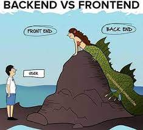

# Week 11 – Tuesday, Intro to Node.js 

## Agenda
1. Mini-Lecture: Introduction to Node.js
1. Code-along: Using Node.js and `YouLearnNode`
1. Exercise 1: [YouLearnNode](https://github.com/workshopper/learnyounode)
1. Exercise 2: [Modules](../class/exercise2/README.md)

## Announcements
1. [Hacktoberfest](https://hacktoberfest.digitalocean.com) 

## References
1. [Node v12 API Documentation](https://nodejs.org/dist/latest-v12.x/docs/api/)
1. [`None 101` on the Learning Portal](https://learn.digitalcrafts.com/flex/lessons/back-end-foundations/node-101/#learning-objectives)

## Homework
1. Finish (or start) [Excersie 2: Modules](../class/exercise2/README.md)
1. Read through the `Node 101` [Course text on the Learning Portal](https://learn.digitalcrafts.com/flex/lessons/back-end-foundations/node-101/#learning-objectives)
1. (Optional) Continue `YouLearnNode` exercises.

