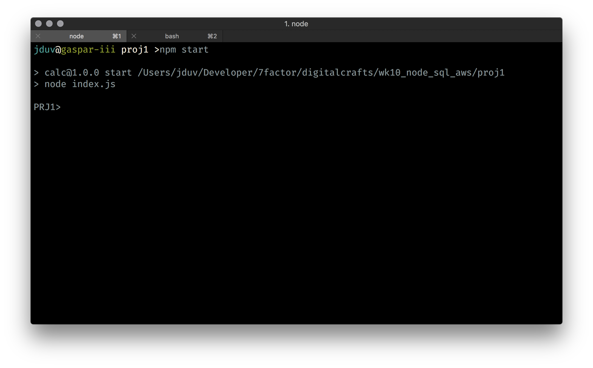
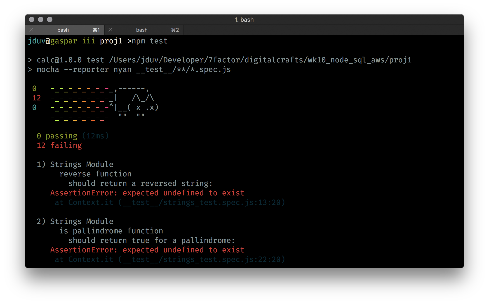
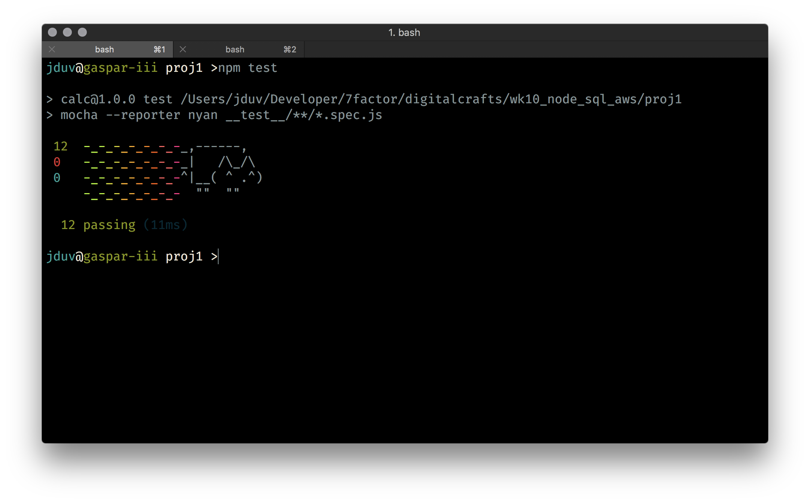

# Project

This project is designed to get you familiar with the basics of how to implement a project in node.js. First, ensure node is installed on your system. Second, you'll need to run a command in order to set up the project from the root directory:

``` bash
npm install
```

Don't worry about what this does just yet, we'll cover that later. After you've ran this command you should see output similar to the following:


There are a few interesting files in this project. First up is ```package.json```. Let's open that file up and give it a look:

``` json
{
  "name": "calc",
  "version": "1.0.0",
  "description": "A calculator package",
  "main": "index.js",
  "scripts": {
    "start": "node index.js",
    "test": "mocha -w"
  },
  "author": "jduv",
  "license": "ISC",
  "dependencies": {
    "mocha": "^4.0.1",
    "should": "^13.1.2"
  }
}
```

This file describes the author of the code, the *dependencies* required to run our project, and how a few ```npm``` commands are executed (discussed in a bit). Every non-trivial node.js project will have one of these--so it's important to understand what it is and how it's used.

In addition to the package file, note the ```index.js``` and the ```strings.js``` files. The *index* file contains the skeleton of our program. The *strings* file is where you'll be making your changes. There's also an interesting file in the ```__test__``` directory that we'll discuss more in a bit. You will be using the tests in that file to grade your own solution!

## Running the Project

Running the project is simple, just type ```npm start```:



You're task is to implement the functions located in the [```strings.js```](./strings.js) file. Check that file for the details of what each function should do along with the test file located in the ```__tests__``` directory. You can invoke your functions by running one of the following four commands after executing an ```npm start```: ```[reverse, is-pallindrome, shift, is-number]```. The next string you type after the command will be passed as an argument to the respective function.

Ground rules for implementation:

1. You cannot use any built in functions. That takes all the fun out of it.
1. Read the testing section very carefully. You need to ensure that all your tests pass before you're done with the project.

## Tests

This project ships with the ```mocha``` test runner. This library provides ways for us to write automated tests for each of our functions. These tests will validate if our function works the way it should. Inside the [```__tests__/strings_test.spec.js```](./__tests__/strings_test.spec.js) file you'll find a set of tests for each function we're implementing. To run the tests:

``` bash
npm test
```

After the tests run you should see the following:



Your job is to make all these tests pass. Each time you make a change to a function in the ```strings.js``` file, run your tests. The goal is to get them all green!



Make sure you read the tests because they will provide you with specific examples of what the functions you're building should do.